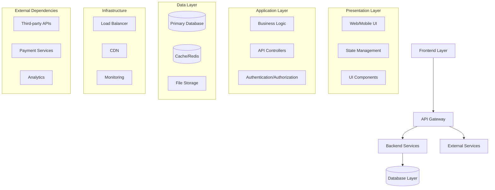
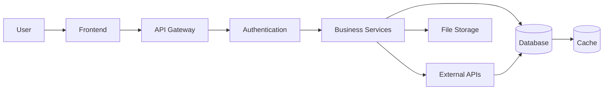

# Project Architecture

## Executive Summary
[High-level architectural overview and design philosophy]

## Architectural Overview

## Component Architecture

### Frontend Components
[Description of frontend architecture, components, and patterns]

### Backend Services
[Description of backend architecture, services, and APIs]

### Data Architecture
[Description of data storage, caching, and flow patterns]

## Data Flow Architecture

## Security Architecture
[Authentication, authorization, and security measures]

## Deployment Architecture
[Infrastructure, environments, and deployment patterns]

## Technology Stack Integration

### Frontend Technologies
- **Framework**: [Primary framework]
- **State Management**: [State management solution]
- **Styling**: [CSS framework/library]
- **Build Tools**: [Build and bundling tools]

### Backend Technologies
- **Runtime**: [Language/runtime]
- **Framework**: [Web framework]
- **Database**: [Database technology]
- **API**: [API design approach]

### Infrastructure Technologies
- **Hosting**: [Hosting platform]
- **Containerization**: [Docker/Kubernetes]
- **CI/CD**: [CI/CD pipeline]

## Implementation Status

### Phase 1: Foundation
- [ ] Database schema design
- [ ] Authentication system
- [ ] Core API endpoints
- [ ] Basic UI framework

### Phase 2: Core Features
- [ ] Main user workflows
- [ ] Business logic implementation
- [ ] UI component library
- [ ] Integration testing

### Phase 3: Advanced Features
- [ ] Performance optimization
- [ ] Advanced features
- [ ] Analytics integration
- [ ] Production deployment

## Component Dependencies

### Internal Dependencies
[Relationships between internal components]

### External Dependencies
[Third-party services and integrations]

## Performance Considerations
[Architecture decisions for performance, scalability, and reliability]

## Monitoring & Observability
[Logging, metrics, and monitoring architecture]

## Future Architecture Evolution
[Planned architectural improvements and scaling strategies]

---
*This architecture.md provides a living visualization of the project structure and component relationships. It is automatically maintained by Agent-SDD agents as the project evolves through different phases.*
